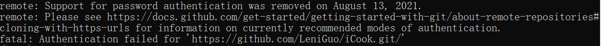

# iCook: Your Personal Cooking Assistant

## 如何启动？

###  拉取代码仓库
```
git clone https://github.com/LeniGuo/iCook.git
```



如遇到这种情况，则是需要令牌获得权限：
1. 在 GitHub 上生成个人访问令牌：
- 登录到你的 GitHub 帐户。
- 点击你的头像，然后选择 "Settings"。
- 在左侧导航中，点击 "Developer settings"。
- 在左侧导航中，点击 "Personal access tokens"。
- 点击 "Generate new token"。
- 给你的令牌一个描述，并选择所需的权限。
- 点击 "Generate token"，然后记录下生成的令牌。请注意，这是生成后唯一的机会，你不能再看到它。
2. 使用个人访问令牌进行身份验证： 在你进行 Git 操作时，使用你的个人访问令牌代替密码。


### 环境配置
- 安装anaconda后，在```iCook/```目录下运行

```
script/conda_install_env.sh
```
注意pytorch的CUDA版本为12.1

- 安装完成后，启动环境

```
conda activate iCook
```

### 下载微调后的LLM
在```iCook/```目录下运行
```
python model/download_llm.py
```

